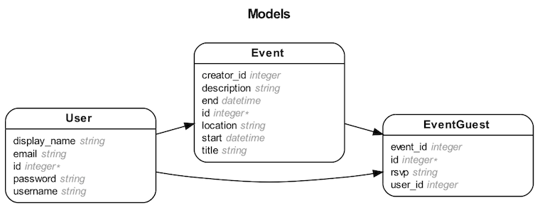

# Final Project: Before You Can Start!

## TODO: Submit your wireframes in the form of a pull request

This example wireframe lives in `readme_assets/wireframe_example.jpg`

Swap it out with your actual wireframes...

## TODO: Submit your ERD in the form of a pull request

This example Entity Relational Diagram lives in `readme_assets/erd_example.png`

Swap it out with your actual ERD...

# README

# CONTRIBUTERS

*   Hannah Shea
*   Krisi Keranova
*   Sonia St.Remy
*   Tristan Favard

# FIND PEACE

Find Peace is an app that aides it's users the ability to find resources when they are at their most vulerable. This app is only known through word of mouth by the medical and mental health community to help women, kids and families that do not reside in a safe environment due to sexual, physical, mental and verbal abuse. As well as those seeking HIV testing or  treatment, emergency housing and transitional housing. It was Mahatma Ghandi that said "a nation's greatness is measured by how it treats it's weakest members." Beacuse of the stafety concerns for our client's when the app renders a dummy page will open that welcomes users to a yoga page. When our client is informed by a medical or mental health profoessional they will know that if they go to the the drop down menu and click on the help button they will enable a chat box  that will filter and ask them what type of servies they are looking for and a list of the resources will render. Once the location is selected a map that will give the client directions to that specific location. Due to safety concerns we have created a yoga video page that will render when the client's abuser maybe looking at their phone or computer.

This is a boilerplate Rails project that uses:

*   ruby -> 2.6.0 or higher
*   Mapbox Gl with a token key
*   Pure CSS 
*   'react_on_rails
*   'rails'
*   Adobe XD

* `ruby ~> 2.7`
* `postgresql` as the database
* `webpacker` with `react`
* the `react_on_rails` gem

## Instructor Setup

* `git clone git@github.com:wyncode/final_project_template.git`
* `cd final_project_template`
* `git remote remove origin`
* Create a repo on GitHub that matches the project name
* `git remote add origin that-repo-name` && `git push origin -u master`
* Make `master` a [protected branch](https://help.github.com/articles/configuring-protected-branches/)
* Pull Requests should only be mergeable after 2 reviews
* At least 1 review needs to be from a [CODEOWNER](https://help.github.com/articles/about-codeowners/)
* Invite team members as collaborators with write access
* Create a Slack Channel, invite team members and TAs
* in Slack: `/github subscribe wyncode/repo_name issues,reviews,comments`

## Student Setup

* `rails db:create` (with your Postgres server up and running)
* `bundle`
* `yarn`
* `rails s`

## Collaboration

* Talk to an instructor about the next feature / enhancement / bugfix you would like to address
* Create an issue with a User Story and Acceptance Criteria
* Create a branch that corresponds with your issue
* Submit a pull request into master
* Request a code review from one of your teammates
* Once it's approved, request a code review from one or more of the project's [CODEOWNERS](CODEOWNERS)

## Deployment

### The Node.js buildback must be added first or precompiling of assets may fail on Heroku: [See this issue](https://github.com/rails/webpacker/issues/1164#issuecomment-443474860)

* `heroku create your-app-name`
* `heroku buildpacks:set --index 1 heroku/nodejs`
* `heroku buildpacks:add heroku/ruby`
* `git push heroku master`
* `heroku run rails db:migrate`
* _optional_: `heroku run rails db:seed`

